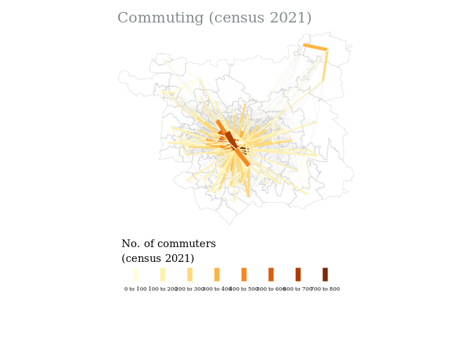
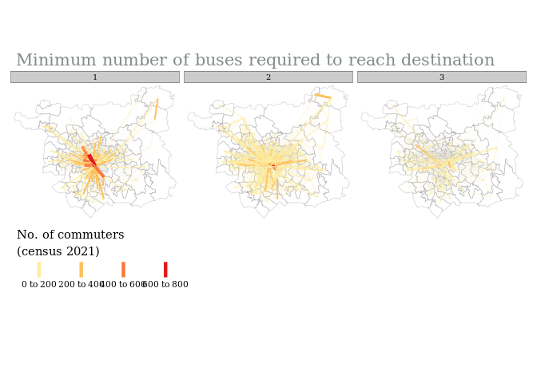
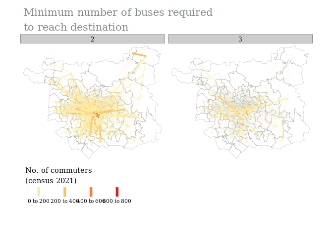
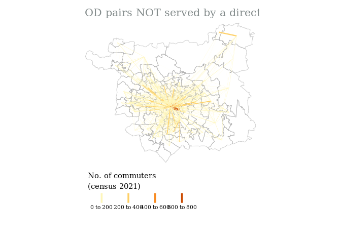
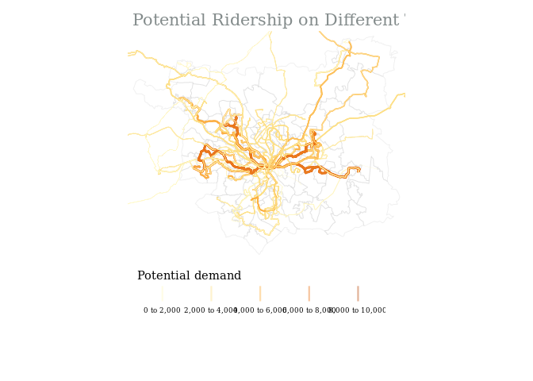

Demand on buses
================
11/17/23

## Introduction

This code visualises the output from `code/demand_on_buses.R` . The
datasets we want to explore together are:

- [ ] demographic data

- [ ] travel time data

  - [x] number of destinations reachable

  - [ ] accessibility to different services

- [ ] travel demand data

  - [ ] census

    - [ ] od demand matrix

    - [ ] demand aggregated onto buses

  - [ ] activity-based model

    - [ ] od demand matrix

    - [ ] demand aggregated onto buses

``` r
source("R/study_area_geographies.R")
source("R/filter_od_matrix.R")

library(tidyverse)
library(sf)
library(tmap)
```

``` r
# -------------------- read in the outputs

# --- decide on geographic resolution

geography <- "MSOA"

# read in geography
study_area <- st_read("data/interim/study_area_boundary.geojson")
```

    Reading layer `study_area_boundary' from data source 
      `/home/hussein/Documents/GitHub/drt-potential/data/interim/study_area_boundary.geojson' 
      using driver `GeoJSON'
    Simple feature collection with 2607 features and 15 fields
    Geometry type: MULTIPOLYGON
    Dimension:     XY
    Bounding box:  xmin: -1.800359 ymin: 53.69898 xmax: -1.290394 ymax: 53.94587
    Geodetic CRS:  WGS 84

``` r
# convert to necessary resolution
study_area <- study_area_geographies(study_area = study_area,
                                     geography = geography)

study_area <- study_area %>%
  st_cast("MULTIPOLYGON")
```

## Loading in travel time and travel demand data

``` r
# --- travel time and demand (ttd) matrix

ttd_matrix <- arrow::read_parquet(paste0("data/raw/travel_demand/od_census_2021/demand_study_area_", tolower(geography), ".parquet"))
# TODO: move this line of code to script that creates n_rides (probably routing_r5r or r5r_routing_wrappers (where rows are summarised))
ttd_matrix <- ttd_matrix %>%
  mutate(n_rides = round(n_rides))

from_id_col = paste0(geography, "21CD_home")
to_id_col = paste0(geography, "21CD_work")

# -------------------- Analysis


# Get median values per origin
ttd_matrix_o <- ttd_matrix %>%
  group_by(across(from_id_col), combination, departure_time) %>%
  summarise(across(c(contains("_time"), n_rides), median, na.rm = TRUE),
            # number of destinations that can be reached
            reachable_destinations = n(),
            # TODO: number of destinations that can be reached directly
            # reachable_destinations_direct = count(n_rides == 1),
            commute_all = sum(commute_all)) %>%
  ungroup() %>%
  mutate(n_rides = round(n_rides))


# Get median values per destination
ttd_matrix_d <- ttd_matrix %>%
  group_by(across(to_id_col), combination, departure_time) %>%
  summarise(across(c(contains("_time"), n_rides), median, na.rm = TRUE),
            # number of origins that can reach the destination
            reachable_origins = n()) %>%
  ungroup() %>%
  mutate(n_rides = round(n_rides))
```

## Loading in bus coverage of travel demand

``` r
# --- data on which OD pairs are covered by direct buses
od_supply <- arrow::read_parquet(paste0("data/interim/travel_demand/", toupper(geography), "/od_pairs_bus_coverage.parquet"))


# get number of unique trips (directional routes) that serve each OD pair, and their headway
od_supply_avg <- od_supply %>%
  group_by(Origin, Destination, start_time) %>%
  summarise(number_of_trips = n(),
            headway_sec_avg = round(mean(headway_secs)),
            headway_sec_min = min(headway_secs),
            bus_per_hr_avg = round(3600/headway_sec_avg),
            bus_per_hr_min = round(3600/headway_sec_min)) %>%
  ungroup()

# filter od pairs by euclidian distance
od_supply_filtered = filter_matrix_by_distance(zones = study_area,
                                               od_matrix = od_supply_avg,
                                               dist_threshold = 1000)

# combine ttd matrix with matrix showing bus provision for ODs
od_sd <- od_supply_filtered %>%
  #TODO: check if we need an inner join (we only have 1 start time atm)
  left_join(ttd_matrix,
            by = c("Origin" = from_id_col,
                   "Destination" = to_id_col,
                   "start_time" = "departure_time"))
```

## Loading in travel demand aggregated onto bus routes

``` r
trips_sd_sf <- st_read(paste0("data/processed/travel_demand/trips_potential_demand_census_", geography, ".geojson"))
```

    Reading layer `trips_potential_demand_census_MSOA' from data source 
      `/home/hussein/Documents/GitHub/drt-potential/data/processed/travel_demand/trips_potential_demand_census_MSOA.geojson' 
      using driver `GeoJSON'
    Simple feature collection with 1443 features and 7 fields (with 418 geometries empty)
    Geometry type: LINESTRING
    Dimension:     XY
    Bounding box:  xmin: -2.090494 ymin: 53.72063 xmax: -0.4052888 ymax: 54.29559
    Geodetic CRS:  WGS 84

``` r
# If we want to get the total demand per day let's try and group by shape_id (same trip at different time has a different trip_id)
trips_sd_sf_shape_sum <- trips_sd_sf %>%
  group_by(shape_id) %>%
  summarise(potential_demand = sum(potential_demand, na.rm = TRUE)) %>%
  ungroup()
```

## Plots

### Preprocessing

``` r
# ---------- get desire lines

od_sd_sf <- od::od_to_sf(x = od_sd %>% st_drop_geometry(),
                         z = study_area %>% st_cast("MULTIPOLYGON"),
                         crs = 4326)

# ---------- create factor column for demand (for facet plots)

od_sd_sf <- od_sd_sf %>%
  mutate(commute_all_fct = cut_interval(commute_all, n = 3),
         bus_per_hr_min_fct = cut_interval(bus_per_hr_min, n = 3))


# ----------- prep the layer
# TODO: remove this when we have multiple start times (currently the od_supply df only has 7:30 - WHY? )
od_sd_sf <- od_sd_sf %>%
  filter(combination == "pt_wkday_morning")
```

### MAP 1: OD pairs with the highest level of commuting

``` r
tm_shape(study_area) +
  tm_borders(col = "grey80",
             alpha = 0.5) +
tm_shape(od_sd_sf) +
  tm_lines(col = "grey80",
           alpha = 0.05) +
  tm_shape(od_sd_sf %>%
             filter(commute_all > quantile(commute_all, probs = 0.90, na.rm = TRUE))) +
  tm_lines(col = "commute_all",
           title.col = "No. of commuters \n(census 2021)",
           lwd = "commute_all",
           legend.lwd.show = FALSE,
           legend.col.is.portrait = FALSE,
           scale = 10) +
  tm_layout(fontfamily = 'Georgia',
            main.title = "Commuting (census 2021)", # this works if you need it
            main.title.size = 1.3,
            main.title.color = "azure4",
            main.title.position = "left",
            legend.outside = TRUE,
            legend.outside.position = "bottom",
            frame = FALSE)
```




### MAP 2: OD pairs by number of buses (transfers) required to connect them

``` r
tm_shape(study_area) +
  tm_borders(col = "grey60",
             alpha = 0.5) +
tm_shape(od_sd_sf) +
  tm_lines(col = "grey80",
           alpha = 0.02) +
  tm_shape(od_sd_sf) +
  tm_lines(col = "commute_all",
           title.col = "No. of commuters \n(census 2021)",
           lwd = "commute_all",
           legend.lwd.show = FALSE,
           legend.col.is.portrait = FALSE,
           palette = "YlOrRd",
           scale = 10) +
  tm_facets(by = "n_rides",
            free.coords = FALSE,
            nrow = 1)  +  # so that the maps aren't different sizes
  tm_layout(fontfamily = 'Georgia',
            main.title = "Minimum number of buses required to reach destination", # this works if you need it
            main.title.size = 1.3,
            main.title.color = "azure4",
            main.title.position = "left",
            legend.outside = TRUE,
            legend.outside.position = "bottom",
            frame = FALSE)  
```




### MAP 3: OD pairs NOT served by a direct bus

``` r
tm_shape(study_area) +
  tm_borders(col = "grey60",
           alpha = 0.5) +
tm_shape(od_sd_sf %>%
           filter(n_rides > 1)) +
  tm_lines(col = "commute_all",
           lwd = "commute_all",
           title.col = "No. of commuters \n(census 2021)",
           legend.lwd.show = FALSE,
           legend.col.is.portrait = FALSE,
           scale = 5) +
  tm_layout(fontfamily = 'Georgia',
            main.title = "OD pairs NOT served by a direct bus",
            main.title.size = 1.3,
            main.title.color = "azure4",
            main.title.position = "left",
            legend.outside = TRUE,
            legend.outside.position = "bottom",
            frame = FALSE)
```




### MAP 4: No. of direct bus reoutes serving OD pair (faceted) by no. of commuters

``` r
tm_shape(study_area) +
  tm_borders(col = "grey60",
             alpha = 0.5) +
tm_shape(od_sd_sf) +
  tm_lines(col = "grey90",
           alpha = 0.5) +
tm_shape(od_sd_sf) +
  tm_lines(col = "number_of_trips",
           lwd = "bus_per_hr_min",
           title.col = "No. of different DIRECT bus \nroutes serving OD pair",
           title.lwd = "Frequency of best route\n(Buses / hr)",
           legend.col.is.portrait = FALSE,
           palette = "Blues",
           scale = 5) +
tm_facets(by = "commute_all_fct",
          free.coords = FALSE,
          nrow = 1) +
tm_layout(fontfamily = 'Georgia',
          main.title = "No. of different DIRECT bus routes serving OD pair\nFaceted by no. of commuters",
          main.title.size = 1.3,
          main.title.color = "azure4",
          main.title.position = "left",
          legend.outside = TRUE,
          legend.outside.position = "bottom",
          legend.stack = "horizontal",
          frame = FALSE)
```




### MAP 5: Fastest vs direct routes

``` r
tm_shape(study_area) +
  tm_borders(col = "grey60",
             alpha = 0.5) +
tm_shape(od_sd_sf) +
  tm_lines(col = "number_of_trips",
           lwd = "bus_per_hr_min",
           title.col = "No. of different DIRECT bus \nroutes serving OD pair",
           title.lwd = "Frequency of best route\n(Buses / hr)",
           legend.col.is.portrait = FALSE,
           palette = "Blues",
           scale = 5) +
  tm_facets(by = "n_rides",
            free.coords = FALSE,
            nrow = 1) +
  tm_layout(fontfamily = 'Georgia',
            main.title = "No. of different DIRECT bus routes serving OD pair\nFaceted by no. of transfers involved in fastest trip",
            main.title.size = 1.3,
            main.title.color = "azure4",
            main.title.position = "left",
            legend.outside = TRUE,
            legend.outside.position = "bottom",
            legend.stack = "horizontal",
            frame = FALSE) 
```


### MAP 6: Demand Aggregated onto bus routes

``` r
tm_shape(study_area) +
  tm_borders(alpha = 0.1) +
  tm_shape(trips_sd_sf %>%
             filter(start_time == "07:30:00")) +
  tm_lines(col = "potential_demand",
           lwd = "potential_demand",
           title.col = "Potential demand",
           legend.lwd.show = FALSE,
           legend.col.is.portrait = FALSE,
           scale = 3,
           legend.is.portrait = FALSE,
           alpha = 0.4) +
  tm_layout(fontfamily = 'Georgia',
            main.title = "Potential Ridership on Different Trips", # this works if you need it
            main.title.size = 1.3,
            main.title.color = "azure4",
            main.title.position = "left",
            legend.outside = TRUE,
            legend.outside.position = "bottom",
            frame = FALSE)
```




